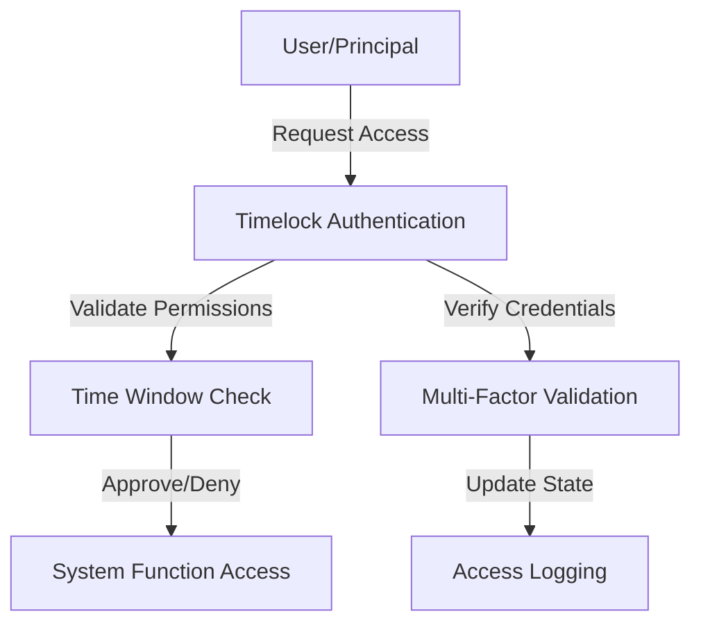

# Robust Timelock Authenticator

A decentralized, blockchain-based access control mechanism that provides secure, time-bound authentication for critical system interactions.

## Overview

Robust Timelock Authenticator is a sophisticated smart contract designed to implement advanced access control and authentication protocols on the Stacks blockchain. By utilizing time-based constraints and multi-factor authorization mechanisms, the contract ensures secure and controlled access to sensitive system functions.

### Key Features

- Time-locked access control
- Multi-stage authentication processes
- Configurable time windows for critical actions
- Transparent and verifiable authorization mechanism
- Prevention of premature or unauthorized access
- Flexible role-based permissions
- Immutable access logs on the blockchain

## Architecture

The system implements a robust timelock mechanism through a single smart contract that manages authentication and access control using advanced cryptographic principles.



### Core Components

1. **Authentication Manager**: Handles user credentials and access permissions
2. **Time Window Controller**: Manages time-based access restrictions
3. **Access Log**: Tracks and records all authentication attempts
4. **Permission Validator**: Verifies user roles and access levels
5. **Cryptographic Security Layer**: Provides additional verification mechanisms

## Contract Documentation

### Authentication Management

#### Request Timed Access

```clarity
(request-timed-access 
  principal: principal
  access-level: uint
  time-window: uint) -> (response bool uint)
```

Requests access to a system function with specific time constraints.

#### Validate Access Permission

```clarity
(validate-access-permission
  principal: principal
  required-level: uint) -> (response bool uint)
```

Checks if a principal has the required access permissions.

### Security Mechanisms

#### Configure Time Window

```clarity
(configure-time-window
  function-id: uint
  start-time: uint
  end-time: uint) -> (response bool uint)
```

Configures a specific time window for accessing a critical system function.

#### Log Access Attempt

```clarity
(log-access-attempt
  principal: principal
  status: bool
  timestamp: uint) -> (response bool uint)
```

Logs an authentication attempt for audit and security purposes.

## Getting Started

### Prerequisites

- Clarinet
- Stacks Wallet
- Advanced understanding of Clarity and blockchain security

### Installation

1. Clone the repository
2. Install dependencies with Clarinet
3. Deploy contract to local Clarinet chain or testnet

### Basic Usage

1. Request timed access:
```clarity
(contract-call? .robust-timelock request-timed-access tx-sender u2 u3600)
```

2. Validate access permission:
```clarity
(contract-call? .robust-timelock validate-access-permission tx-sender u1)
```

## Function Reference

### Read-Only Functions

- `get-access-log`: Retrieve authentication logs
- `check-time-window`: Verify current access window
- `get-principal-permissions`: Retrieve principal's access levels

### Public Functions

- `request-timed-access`: Request access with time constraints
- `validate-access-permission`: Check access permissions
- `configure-time-window`: Set time-based access rules
- `log-access-attempt`: Record authentication events

## Development

### Testing

Run tests using Clarinet:
```bash
clarinet test
```

### Local Development

1. Start local Clarinet console:
```bash
clarinet console
```

2. Deploy contract:
```bash
(contract-call? .robust-timelock ...)
```

## Security Considerations

### Advanced Protection Mechanisms

- Cryptographically secure time-window validation
- Multi-layer authentication checks
- Immutable access logging
- Prevention of replay attacks
- Configurable permission granularity

### Best Practices

- Implement comprehensive access control strategies
- Regularly audit and update time windows
- Monitor and analyze access logs
- Use minimal required permission levels
- Implement additional off-chain verification for critical systems

## Potential Use Cases

- Governance contract access control
- High-value transaction authorization
- Privileged system function management
- Secure administrative interfaces
- Regulated blockchain interactions